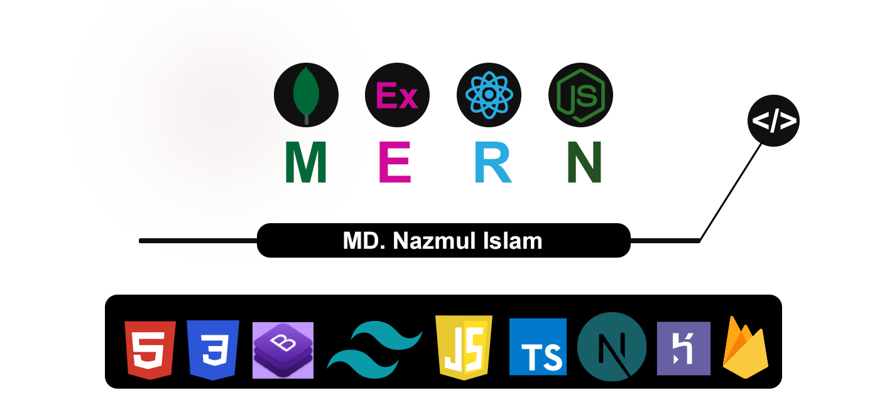
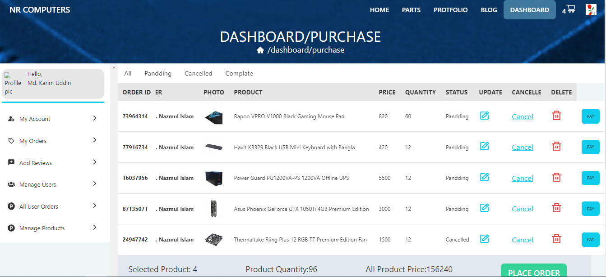
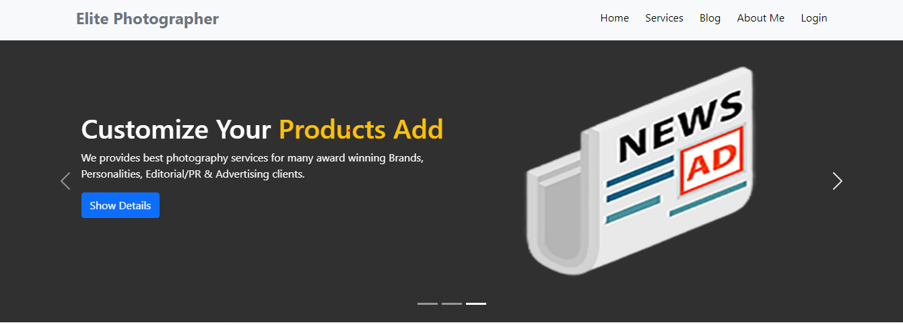

<h1 align="center">👋 Hi, I'm <a href="https://www.linkedin.com/in/developernazmul/" target="_blank">Md. Nazmul islam</a></h1>

<h2 align="center" align-items="center">Designer and Front-end Web Developer from BD</h2>

- ### 🌱 I’m currently learning **Node.Js**

- ### 👯 I’m looking to collaborate on **ReactJS, JavaScrpt, ExpressJS, TypeScript, Next.js, MongoDB, Projects**

- ### 👨‍💻 All of my projects are available at [my portfolio]()

- ### 💬 Ask me about **ReactJs, JavaScript, ES6, Express, NodeJs, MongoDB, Heroku or anything which relate to Frontend and backend**

- ### 📫 How to reach me **[LinkedIn](https://www.linkedin.com/in/developernazmul)**

## My Web Development skills

## Others Skills

## Documantation

- ### [Express with MongoDb](https://github.com/dev-nazmulislam/express-mongodb-short-note)
- ### [React Basic to Advanced](https://github.com/dev-nazmulislam/react-short-note)
- ### [JavaScript Beginner to Advanced](https://github.com/dev-nazmulislam/javascript-short-note)
- ### [JavaScript Problem Solving](https://github.com/dev-nazmulislam/javaScript-problem-solving)
- ### [JavaScript parameter handle or error control](https://github.com/dev-nazmulislam/function-parameter-handle)

- ### [CSS-short-note](https://github.com/dev-nazmulislam/css-short-note)

## Recent Project’s

 <h3>Manufactural product management website</h3>
 
- Build Width: **React, React Router, React-Bootstrap, Express, Firebase, React firebase hooks, React hooks form, React Icons, MongoDB, Heroku**

[Live Site]()
||
[Client site Code]()
||
[Server site Code]()

 
26-05-2022

 

 <h3>Book Ware House is a simple stock management website</h3>
 
- Build Width: **React, React Router, React-Bootstrap, Express, Firebase, React firebase hooks, React hooks form, React Icons, MongoDB, Heroku**

[Live Site](https://books-store-dfd37.web.app/)
||
[Client site Code](https://github.com/dev-nazmulislam/book-ware-house-client)
||
[Server site Code](https://github.com/dev-nazmulislam/book-ware-house-server)

 
08-04-2022

 

 <h3>This is Elite Photography fully responsive website.</h3>
 
- Build Width: **React, React Router, React-Bootstrap, Firebase, React Icons**

[Live Site](https://elite-studio-429e1.web.app/)
||
[Github Link](https://github.com/dev-nazmulislam/elite-photographer)

 
14-04-2022

 

 

## Connect with me !

