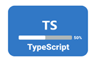
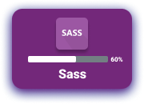
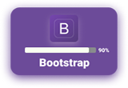
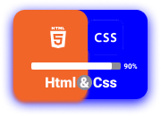

### Hi there .......!

### <ins>Wellcome to my Github Profile.</ins>

### I am `Md. Nazmul Islam`, A Full Stack Web Developer from Bangladesh. I spend most of the time coding outstanding projects.

## My Web Development skills

## Others Skills

## Tutorials

- [JavaScript Tutorial beginner to advanced (Simple Note)](https://github.com/dev-nazmulislam/javascript-short-note)
- [JavaScript Problem Solving](https://github.com/dev-nazmulislam/javaScript-problem-solving)
- [JavaScript Function parameter handle or error control](https://github.com/dev-nazmulislam/function-parameter-handle)

- [CSS-short-note](https://github.com/dev-nazmulislam/css-short-note)

## Web Components Project’s

<table align="center">
      <tr>
        <td><a href="#">Card Payment UI</a></td>
        <td><a href="#">Custom Alert</a></td>
        <td><a href="#">Custom Confirm Box</a></td>
        <td><a href="#">Custom Range Slider</a></td>
        <td><a href="#">Dark Light Mode</a></td>
      </tr>
      <tr>
        <td><a href="#">Filterable Gallery</a></td>
        <td><a href="#">Foalting Action Button</a></td>
        <td><a href="#">Form Validation</a></td>
        <td><a href="#">Image Gallery Thumbnail</a></td>
        <td><a href="#">Image Slider</a></td>
      </tr>
      <tr>
        <td><a href="#">Modal</a></td>
        <td><a href="#">Modal with Progress Bookmark</a></td>
        <td><a href="#">Movie App</a></td>
        <td><a href="#">Multi-Step Form</a></td>
        <td><a href="#">Music Player App</a></td>
      </tr>
      <tr>
        <td><a href="#">Page Animation</a></td>
        <td><a href="#">Smoth Scrolling</a></td>
        <td><a href="#">Pricing Table</a></td>
        <td><a href="#">Product Filter</a></td>
        <td><a href="#">Product Slider</a></td>
      </tr>
      <tr>
        <td><a href="#">Responsive Movile Menu</a></td>
        <td><a href="#">Scroll To Top</a></td>
        <td><a href="#">Vertical Tabs</a></td>
        <td><a href="#">Type Writing Effect</a></td>
        <td><a href="#">Click to copy</a></td>
      </tr>
    </table>

## Mathmatical Project’s

<table align="center">
      <tr>
        <td><a href="#">Length Converter</a></td>
        <td><a href="#">Discount Calculator</a></td>
        <td><a href="#">Interest Calculator</a></td>
        <td><a href="#">Simple Calculator</a></td>
        <td><a href="#">BMI Calculator</a></td>
      </tr>
      <tr>
        <td><a href="#">TIP Calculator</a></td>
        <td><a href="#">Age Calculator</a></td>
        <td><a href="#">GPA Calculator</a></td>
        <td><a href="#">Digital Clock</a></td>
        <td><a href="#">Analog Clock</a></td>
      </tr>
      <tr>
        <td><a href="#">Stopwatch</a></td>
        <td><a href="#">Timmer</a></td>
        <td><a href="#">Character Count</a></td>
        <td><a href="#">Word Count</a></td>
        <td><a href="#">Vowel Count</a></td>
      </tr>
      <tr>
        <td><a href="#">Palindrome Checker</a></td>
        <td><a href="#">Password Generator</a></td>
        <td><a href="#">Random Number Generator</a></td>
        <td><a href="#">Color Generator</a></td>
        <td><a href="#">Quiz APP</a></td>
      </tr>
      <tr>
        <td><a href="#">Weather APP</a></td>
        <td><a href="#">Counter app</a></td>
        <td><a href="#">Notes App</a></td>
        <td><a href="#">Bookmark app</a></td>
        <td><a href="#">Crud App</a></td>
      </tr>
    </table>

## Complate Project’s

<table>
  <thead align="center">
    <tr border: none;>
      <td><b>HTML & CSS</b></td>
      <td><b>HTML & Bootstrap</b></td>
      <td><b>HTML & Tailwind</b></td>
      <td><b>JavaScript</b></td>
      <td><b>React</b></td>
      <td><b>Node-Js</b></td>
      <td><b>TypeScript</b></td>
    </tr>
  </thead>
  <tbody>
    <tr>
      <td><a href="https://github.com/dev-nazmulislam/mission-2022">Mission-2022</a></td>
      <td><a href="https://github.com/dev-nazmulislam/e-commarce-website">e-commarce Website</a></td>
      <td><a href="https://github.com/dev-nazmulislam/islami-bank">Islami Bank</a></td>
      <td><a href="https://github.com/dev-nazmulislam/income-expanses-calcualtor">Income & Expenses Calculator</a></td>
      <td><a href="#">Project -01</a></td>
      <td><a href="#">Project -01</a></td>
      <td><a href="#">Project -01</a></td>
    </tr>
    <tr>
      <td><a href="https://github.com/dev-nazmulislam/influencer-products">Influencer Products</a></td>
      <td><a href="https://github.com/dev-nazmulislam/soronika-convention">Shoronika Convention</a></td>
      <td><a href="#">Project -02</a></td>
      <td><a href="https://github.com/dev-nazmulislam/intarest-discount-calculator">Intarest & Discount Calculator</a></td>
      <td><a href="#">Project -02</a></td>
      <td><a href="#">Project -02</a></td>
      <td><a href="#">Project -02</a></td>
    </tr>
    <tr>
      <td><a href="https://github.com/dev-nazmulislam/blogin">Blogin</a></td>
      <td><a href="https://github.com/dev-nazmulislam/e-school">E-School</a></td>
      <td><a href="#">Project -03</a></td>
      <td><a href="#">Project -03</a></td>
      <td><a href="#">Project -03</a></td>
      <td><a href="#">Project -03</a></td>
      <td><a href="#">Project -03</a></td>
    </tr>
    <tr>
      <td><a href="https://github.com/dev-nazmulislam/leader-board">Leader Board</a></td>
      <td><a href="https://github.com/dev-nazmulislam/physionic">Physionic</a></td>
      <td><a href="#">Project -04</a></td>
      <td><a href="#">Project -04</a></td>
      <td><a href="#">Project -04</a></td>
      <td><a href="#">Project -04</a></td>
      <td><a href="#">Project -04</a></td>
    <tr>
      <td><a href="https://github.com/dev-nazmulislam/support-session">Support session</a></td>
      <td><a href="https://github.com/dev-nazmulislam/trafalgar">Trafalgar</a></td>
      <td><a href="#">Project -05</a></td>
      <td><a href="#">Project -05</a></td>
      <td><a href="#">Project -05</a></td>
      <td><a href="#">Project -05</a></td>
      <td><a href="#">Project -05</a></td>
    </tr>
    </tbody>
</table>

## Connect with me !

