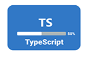

### Hi there .......!

<h1 align="center">👋 Hi, I'm <a href="https://www.linkedin.com/in/developernazmul/" target="_blank">Md. Nazmul islam</a></h1>

<h2 align="center" align-items="center">Designer and Front-end Web Developer from BD</h2>

- 🌱 I’m currently learning **Node.Js**

- 👯 I’m looking to collaborate on **ReactJS, JS, ExpressJS, TypeScript, Next.js, MongoDB, Projects**

- 👨‍💻 All of my projects are available at [my portfolio]()

- 💬 Ask me about **ReactJs, JavaScript, ES6, Express, NodeJs, MongoDB, Heroku or anything which relate to Frontend and backend**

- 📫 How to reach me **[LinkedIn](https://www.linkedin.com/in/developernazmul)**

## My Web Development skills

## Others Skills

## Documantation

- [Express with MongoDb](https://github.com/dev-nazmulislam/express-mongodb-short-note)
- [React Basic to Advanced](https://github.com/dev-nazmulislam/react-short-note)
- [JavaScript Beginner to Advanced](https://github.com/dev-nazmulislam/javascript-short-note)
- [JavaScript Problem Solving](https://github.com/dev-nazmulislam/javaScript-problem-solving)
- [JavaScript parameter handle or error control](https://github.com/dev-nazmulislam/function-parameter-handle)

- [CSS-short-note](https://github.com/dev-nazmulislam/css-short-note)

## Recent Project’s

 <h3>Book Ware House is a simple stock management website</h3>
 
- Build Width: **React, React Router, React-Bootstrap, Express, Firebase, React firebase hooks, React hooks form, React Icons, MongoDB, Heroku**

[Live Site](https://books-store-dfd37.web.app/)
||
[Client site Code](https://github.com/dev-nazmulislam/book-ware-house-client)
||
[Server site Code](https://github.com/dev-nazmulislam/book-ware-house-server)

 
14-04-2022

 

<table>
  <thead align="center">
    <tr border: none;>
      <td><b>HTML & CSS</b></td>
      <td><b>HTML & Bootstrap</b></td>
      <td><b>HTML & Tailwind</b></td>
      <td><b>JavaScript</b></td>
      <td><b>React</b></td>
      <td><b>Node-Js</b></td>
      <td><b>TypeScript</b></td>
    </tr>
  </thead>
  <tbody>
    <tr>
      <td><a href="https://github.com/dev-nazmulislam/mission-2022">Mission-2022</a></td>
      <td><a href="https://github.com/dev-nazmulislam/e-commarce-website">e-commarce Website</a></td>
      <td><a href="https://github.com/dev-nazmulislam/islami-bank">Islami Bank</a></td>
      <td><a href="https://github.com/dev-nazmulislam/income-expanses-calcualtor">Income & Expenses Calculator</a></td>
      <td><a href="#">Project -01</a></td>
      <td><a href="#">Project -01</a></td>
      <td><a href="#">Project -01</a></td>
    </tr>
    <tr>
      <td><a href="https://github.com/dev-nazmulislam/influencer-products">Influencer Products</a></td>
      <td><a href="https://github.com/dev-nazmulislam/soronika-convention">Shoronika Convention</a></td>
      <td><a href="#">Project -02</a></td>
      <td><a href="https://github.com/dev-nazmulislam/intarest-discount-calculator">Intarest & Discount Calculator</a></td>
      <td><a href="https://github.com/dev-nazmulislam/book-ware-house-client">Book Ware House</a></td>
      <td><a href="#">Project -02</a></td>
      <td><a href="#">Project -02</a></td>
    </tr>
    <tr>
      <td><a href="https://github.com/dev-nazmulislam/blogin">Blogin</a></td>
      <td><a href="https://github.com/dev-nazmulislam/e-school">E-School</a></td>
      <td><a href="#">Project -03</a></td>
      <td><a href="#">Project -03</a></td>
      <td><a href="https://github.com/dev-nazmulislam/elite-photographer">Elite Photography</a></td>
      <td><a href="#">Project -03</a></td>
      <td><a href="#">Project -03</a></td>
    </tr>
    <tr>
      <td><a href="https://github.com/dev-nazmulislam/leader-board">Leader Board</a></td>
      <td><a href="https://github.com/dev-nazmulislam/physionic">Physionic</a></td>
      <td><a href="#">Project -04</a></td>
      <td><a href="#">Project -04</a></td>
      <td><a href="https://github.com/dev-nazmulislam/product-analysis">Product review</a></td>
      <td><a href="#">Project -04</a></td>
      <td><a href="#">Project -04</a></td>
    <tr>
      <td><a href="https://github.com/dev-nazmulislam/support-session">Support session</a></td>
      <td><a href="https://github.com/dev-nazmulislam/trafalgar">Trafalgar</a></td>
      <td><a href="#">Project -05</a></td>
      <td><a href="#">Project -05</a></td>
      <td><a href="#">Project -05</a></td>
      <td><a href="#">Project -05</a></td>
      <td><a href="#">Project -05</a></td>
    </tr>
    </tbody>
</table>

## Connect with me !

