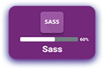
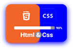

### Hi there .......!

### <ins>Wellcome to my Github Profile.</ins>

### I am `Md. Nazmul Islam` a Full Stack Web Developer from Bangladesh. I spend most of the time coding outstanding projects.

## My Web Development skills

## Others Skills

## Complate Project’s

<table>
  <thead align="center">
    <tr border: none;>
      <td><b>HTML & CSS</b></td>
      <td><b>HTML & Bootstrap</b></td>
      <td><b>HTML & Tailwind</b></td>
      <td><b>JavaScript</b></td>
      <td><b>React</b></td>
      <td><b>Node-Js</b></td>
      <td><b>TypeScript</b></td>
    </tr>
  </thead>
  <tbody>
    <tr>
      <td><a href="https://github.com/dev-nazmulislam/mission-2022">Mission-2022</a></td>
      <td><a href="https://github.com/dev-nazmulislam/e-commarce-website">e-commarce Website</a></td>
      <td><a href="#">Project -01</a></td>
      <td><a href="#">Project -01</a></td>
      <td><a href="#">Project -01</a></td>
      <td><a href="#">Project -01</a></td>
      <td><a href="#">Project -01</a></td>
    </tr>
    <tr>
      <td><a href="https://github.com/dev-nazmulislam/influencer-products">Influencer Products</a></td>
      <td><a href="https://github.com/dev-nazmulislam/soronika-convention">Shoronika Convention</a></td>
      <td><a href="#">Project -02</a></td>
      <td><a href="#">Project -02</a></td>
      <td><a href="#">Project -02</a></td>
      <td><a href="#">Project -02</a></td>
      <td><a href="#">Project -02</a></td>
    </tr>
    <tr>
      <td><a href="https://github.com/dev-nazmulislam/blogin">Blogin</a></td>
      <td><a href="https://github.com/dev-nazmulislam/e-school">E-School</a></td>
      <td><a href="#">Project -03</a></td>
      <td><a href="#">Project -03</a></td>
      <td><a href="#">Project -03</a></td>
      <td><a href="#">Project -03</a></td>
      <td><a href="#">Project -03</a></td>
    </tr>
    <tr>
      <td><a href="https://github.com/dev-nazmulislam/leader-board">Leader Board</a></td>
      <td><a href="https://github.com/dev-nazmulislam/physionic">Physionic</a></td>
      <td><a href="#">Project -04</a></td>
      <td><a href="#">Project -04</a></td>
      <td><a href="#">Project -04</a></td>
      <td><a href="#">Project -04</a></td>
      <td><a href="#">Project -04</a></td>
    <tr>
      <td><a href="https://github.com/dev-nazmulislam/support-session">Support session</a></td>
      <td><a href="https://github.com/dev-nazmulislam/trafalgar">Trafalgar</a></td>
      <td><a href="#">Project -05</a></td>
      <td><a href="#">Project -05</a></td>
      <td><a href="#">Project -05</a></td>
      <td><a href="#">Project -05</a></td>
      <td><a href="#">Project -05</a></td>
    </tr>
    </tbody>
</table>

## Connect with me !

